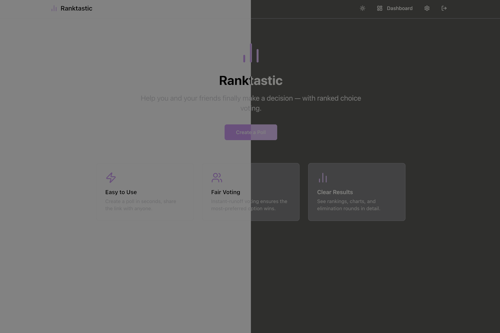
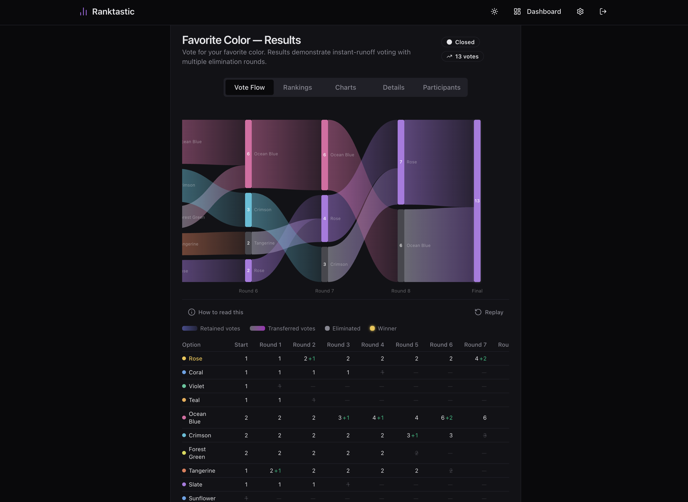

<p align="center">
  
</p>

<p align="center">
  
</p>

# Ranktastic

> Help you and your friends finally make a decision.

Ranktastic is a self-hosted **ranked choice voting** app for groups. Create a poll, share a link, and let everyone rank their preferences — Ranktastic uses **Instant Runoff Voting (IRV)** to find the option with the broadest support.

---

## Features

### Voting
- **Ranked choice (IRV)** — voters rank options by preference; a winner emerges through elimination rounds
- **Drag-and-drop ranking** — intuitive interface powered by @hello-pangea/dnd
- **No account required** — voters identify with name and email only
- **Duplicate vote prevention** — one vote per email address per poll

### Polls
- **Optional expiration** — polls auto-close at a set date and time
- **Private polls** — invite-only mode restricts voting to a whitelist of emails
- **Vote editing** — optionally let voters return and change their rankings
- **Option randomization** — reduce position bias by shuffling options per voter

### Results
- **Sankey vote flow diagram** — animated visualization of vote transfers through IRV rounds
- **Charts** — first-choice distribution (pie) and final scores (bar)
- **Full elimination round breakdown** — see exactly how the winner emerged

### Sharing
- **QR code generation** — downloadable QR codes for each poll
- **Native share API** — one-tap sharing on supported devices
- **Copy link** — instant clipboard sharing

### Email
- **Vote verification** — optionally require voters to confirm via email link
- **Results notifications** — voters and subscribers get emailed when a poll closes
- **Notification subscriptions** — anyone can subscribe to poll results without voting

### Admin
- **Dashboard** — manage all polls, view site-wide stats
- **Poll controls** — close, reopen, clone, edit, clear votes, or delete
- **Settings** — configure app behavior from the UI

### UI
- **Dark / light theme** — persisted user preference
- **Responsive design** — works on mobile and desktop
- **Accessible** — Radix UI primitives with proper ARIA attributes

---

## Tech Stack

| Layer | Technology |
|---|---|
| Backend | Python, FastAPI, SQLAlchemy, SQLite, aiosqlite |
| Frontend | React 19, Vite, TypeScript, TailwindCSS 4 |
| Auth | JWT tokens in HTTP-only cookies, bcrypt |
| Package managers | `uv` (Python), `npm` (JS) |
| Deployment | Docker Compose |

---

## Quick Start

### Requirements

- Docker and Docker Compose

### Steps

```bash
git clone https://github.com/yourusername/ranktastic.git
cd ranktastic

# Create your config (then edit it — at minimum set SECRET_KEY and ADMIN_PASSWORD)
cp .env.example .env

docker compose up -d
```

Open **http://localhost:8080** in your browser. Log in at `/admin/login` with the credentials you set.

---

## Configuration

All configuration is done via environment variables. Copy `.env.example` to `.env` and edit as needed.

### Required

| Variable | Default | Description |
|---|---|---|
| `SECRET_KEY` | *(none)* | Secret for signing JWT tokens. Generate with: `openssl rand -base64 32` |
| `ADMIN_USERNAME` | `admin` | Admin account username (set on first run) |
| `ADMIN_PASSWORD` | `changeme` | Admin account password (set on first run) |

### Network

| Variable | Default | Description |
|---|---|---|
| `PORT` | `8080` | Host port the app is exposed on |
| `BASE_URL` | `http://localhost:8080` | Public URL — used in share links and email links |

### Data

| Variable | Default | Description |
|---|---|---|
| `DATA_PATH` | `./data` | Host path for the SQLite database. For Unraid: `/mnt/user/appdata/ranktastic` |

### Access Control

| Variable | Default | Description |
|---|---|---|
| `ALLOW_PUBLIC_POLLS` | `true` | Set to `false` to restrict poll creation to the admin only |

### Email (optional)

Email is required for vote verification and results notifications.

| Variable | Default | Description |
|---|---|---|
| `EMAIL_ENABLED` | `false` | Enable SMTP email sending |
| `SMTP_HOST` | *(none)* | SMTP server hostname |
| `SMTP_PORT` | `587` | SMTP server port |
| `SMTP_USER` | *(none)* | SMTP username |
| `SMTP_PASSWORD` | *(none)* | SMTP password |
| `SMTP_FROM` | `noreply@ranktastic.local` | From address for outgoing emails |
| `SMTP_TLS` | `true` | Set to `false` for plain SMTP (no TLS/STARTTLS) |

---

## Development Setup

### Requirements

- Python 3.13+, [`uv`](https://docs.astral.sh/uv/)
- Node.js, `npm`
- [`just`](https://just.systems/) (optional but recommended)

### Setup

```bash
just setup        # Install backend + frontend dependencies
cp .env.example .env
just dev          # Start backend (port 8000) + frontend (port 5173)
```

### Available Commands

```bash
just dev          # Start both dev servers
just backend-dev  # Backend only (FastAPI with --reload)
just frontend-dev # Frontend only (Vite HMR)
just test         # Run backend tests + frontend type-check
just build        # Build Docker images
just up           # Start production stack
just down         # Stop production stack
just logs         # Tail container logs
just redeploy     # Rebuild + restart
```

---

## Data Storage

Poll data is stored in a single SQLite file in `DATA_PATH`. To back up or migrate, copy that file.

---

## License

MIT
